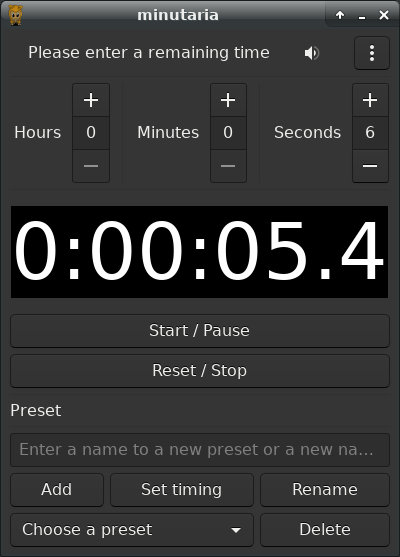

minutaria
=========

minutaria is a basic educational Python timer.

The project is educational, it aims to teach myself programming, python programming, python's stdlib, tools (pdb, venv, mypy...) and ecosystem, development best pratices, git and some software testing libraries or frameworks.

The project is separed in 3 parts:

- a module as a library
- a CLI utility
- a simple ncurses GUI using parts of the module, also usable with CLI
- a GTK GUI using the full module and so also usable with CLI

Done
----

- Use OOP approach
- Use *datetime* module
- Display time ISO 8601 format like as hh:mm:ss.n
- Use *argparse* module to build the CLI utility
- Manage presets and use *json* module to store them
- ncurses interface via *curses* Python standard module with basic start/relaunch/quit command also usable with the lib's CLI
- Gradually introduce type hints
- Some fixes with Flake8 and PyLint
- Minimal documentation
- Minimal log system
- Unit tests with unittest and pytest without test run
- packaging
- Usable with a GTK GUI and so:
    - reset the timer
    - pause/continue the timer
    - add/use/manage presets
    - play a sound at 00:00:00.0
    - manage alarm volum
    - display an "About" window.

Dependencies
------------

Nothing except Python 3 and modules from the standard library for the lib and the ncurses TUI, currently :

- *datetime*, *argparse*, *logging* and *json* for the lib
- *curses*, *datetime*, *logging* and *os* for the ncurses interface.

The GTK GUI naturally use GTK and also use cheofusi's `just-playback library <https://github.com/cheofusi/just_playback>`_ for playing sound, licensed under the MIT License.

For the GTK GUI, please follow `the guide <https://pygobject.readthedocs.io/en/latest/getting_started.html#gettingstarted>`_ to install it.

For me, in short, on Debian :

- Create virtual environment if not already done:
    ``python3 -m venv venv``
- Enter it:
    ``source venv/bin/activate``
- Execute the following command to install the build dependencies and GTK:
    ``sudo apt install libgirepository1.0-dev gcc libcairo2-dev pkg-config python3-dev gir1.2-gtk-3.0``
- Execute:
    ``pip3 install pycairo``
- Execute
    ``pip3 install PyGObject``
- For just-playback:
    ``pip3 install just_playback``

A requirement.txt is inclued in this repository for the three last steps, you can use it with:
    ``pip3 install -r requirements.txt``

Use
---

libminutaria.py is a library module which provides everything to create the timer application. It is testable by beeing launched in a terminal emulator which executes a default 5 seconds timer.

minutaria-cli.py contains a fully usable command line interface to libminutaria. It executes a default timer if launched without argument. Presets created by this way are stored in a JSON file. Use -h/--help arguments for more information.

minutaria-curses.py contains the basic ncurses interface and so shall be launched via command line. It offers a start/pause/continue/relaunch/quit functionality and is fully usable with CLI arguments identically to minutaria-cli.py. This user interface shall only be use on Unix system as the Windows version isn't included in the standard library, the script contains a WINDOWS_CHECK parameter for this purpose. Nervertheless it should be usable with WSL (not tested).

To use any interface to libminutaria, libminutaria shall be installed. As it is an educational project, do it in a virtual environment :

- Create virtual environment if not already done:
    ``python3 -m venv venv``
- Enter it:
    ``source venv/bin/activate``
- Install/update PyPA’s build:
    ``python3 -m pip install --upgrade build``
- Build from the source:
    ``python3 -m build``
- Install the ``.whl`` file found in ``dist/``:
    ``python3 -m pip install dist/libminutaria-1.0-py3-none-any.whl``

libminutaria shall also be install the same way to launch tests from the tests directory.

License
-------

minutaria is licensed under `the MIT/Expat License
<https://spdx.org/licenses/MIT.html>`_. See LICENSE file for details.

For the assets, see the file ``attribution.rst`` in the ``assets/`` directory.

